ifdef::env-github[]
:tip-caption: :bulb:
:note-caption: :information_source:
:important-caption: :heavy_exclamation_mark:
:caution-caption: :fire:
:warning-caption: :warning:
endif::[]

= Author profiles
:icons: image
:icondir: images/icons/
:icontype: svg
:toc:
:toclevels: 4

== Goal

Every author should have one profile that lists all of their  works and clearly differentiates them from other authors.

== Problem

Author profiles are created in combination with the importing of a book, and imports often lack the necessary data to tell different authors apart.

== Solution

Author profiles can be edited by anyone with an OpenLibrary account.

== Procedure

Open any author's profile and click the _Edit_ button at the upper right corner of the screen. If you get a _Permission denied_ error, you need to log in to OpenLibrary (see: OpenLibrary accounts).

=== Name

Usually the author’s real name, as written in legal documents of the author’s place of origin. Pen names, pseudonyms, transliterations and other alternative names should go into the _Does this author go by any other names?_ field.

If an author’s name is usually abbreviated, like C. S. Lewis or J. R. R. Tolkien, please leave a space between different abbreviated letters.

====
:example:
The Ukrainian author Марія Василівна Матіос is known as Maria Matios in countries that use Latin script. Hence, her profile name should be Марія Василівна Матіос, regardless of how her name was written on any given book.
====

We do not differentiate name forms but simply write the name as it would be spoken in the original language. Not all cultures follow the first name, middle name, surname form common in English, and translation between different naming conventions can be daunting.

NOTE: The library convention to write _LAST NAME, first name middle name_ stems from the time of index cards in paper registers, when a human had to manually check card for card to find a given book. Modern computers can search many parts of an index simultaneously, making this structure mostly obsolete.

==== Organizations as author

Certain organizations publish works under their own name, withholding the name of individual authors. This happens most often when the work was created by a large group of contributors whose individual effort on the whole cannot be measured and who are also members or employees of the publishing body.

This mostly happens with large bureaucracies like government agencies, intergovernmental organizations or other transnational organizations.

If an organization publishes a work, it is treated just like an individual author.

==== Shared pseudonyms

Sometimes a group of writers shares a single pen name. In case of shared pseudonyms, the author profile uses the pseudonym as the main name and has the real authors behind the pseudonym listed in the _Does this author go by any other names?_ field. Also, all authors using the shared pseudonyms have the pseudonym’s name written in their _Does this author go by any other names?_ field.

====
:example:
A very notorious case of such a pen name was link:https://openlibrary.org/authors/OL7940792A/[Carmen Mola], a supposedly female author who later turned out to be a male author trio: link:https://openlibrary.org/authors/OL5086238A/[Agustín Martínez], Jorge Díaz and Antonio Mercero.

In this case, both Carmen Mola and the three real authors would get a separate profile. Carmen Mola would have three entries under _Does this author go by any other names?_: Agustín Martínez, Jorge Díaz and Antonio Mercero.

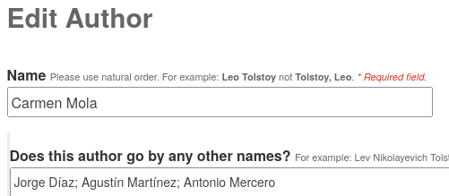

Each of the three authors would have the entry Carmen Mola in the Name field as shown in the entry of Agustín Martínez.

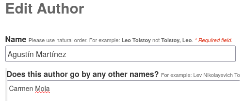
====

==== A short bio?

Ideally, a bio should give a short overview of the author’s life and interests. This can greatly help to differentiate between authors with similar names or to assign books correctly from a conflated entry.

An organization as author should have its role and purpose described.

A shared pseudonym should indicate that the profile is used by multiple authors.

=== Dates

The dates of birth and death. This helps to differentiate between authors with similar or identical names.

=== Does this author go by any other names?

Enter any pen names, pseudonyms, transliterations and other alternative names the author might be known as. You can also include common abbreviations or misspellings of an author’s name.

=== Identifiers

Identifiers are unique numerical or alphanumerical codes that identify an entity on a platform. At the moment, OpenLibrary supports the following identifiers:

* OpenLibrary ID
* Amazon ID
* Goodreads
* ISNI
* Librarything
* LibriVox
* Project Gutenberg
* The Storygraph
* VIAF
* Wikidata
* YouTube

These identifiers serve different purposes and are of different importance for OpenLibrary.

==== OpenLibrary ID

This is the internal ID of OpenLibrary. It is created automatically and cannot be edited.

OpenLibrary author IDs always start with *OL*, followed by numbers, and ending with *A*.

==== ISNI, VIAF

The _Virtual International Authority File (VIAF)_ and the _International Standard Name Identifier (ISNI)_ are the most reliable platforms to identify authors. Both combine vetted data from different sources into one dataset. They are indispensable for merging authors.

Both IDs are numerical and are clearly shown as an ID on their respective websites.

==== Wikidata

Wikidata is a multilingual knowledge graph. It not only identifies the author, but also powers the _Already Read Stats_ on OpenLibrary. This requires a link between Wikidata and OpenLibrary, so each must know the ID of the other.

The Wikidata ID always starts with a *Q* followed by numbers and can be found in parentheses directly after the author’s name (highlighted in blue in the screenshot below).

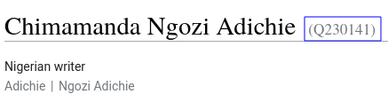

To link Wikidata to OpenLibrary, you also need to enter the _OpenLibrary author ID_ into Wikidata. On the author’s Wikidata page at wikidata.org, scroll down to the bottom of the _Identifiers_ section and click on the _+add statement link_ as shown in the screenshot below.

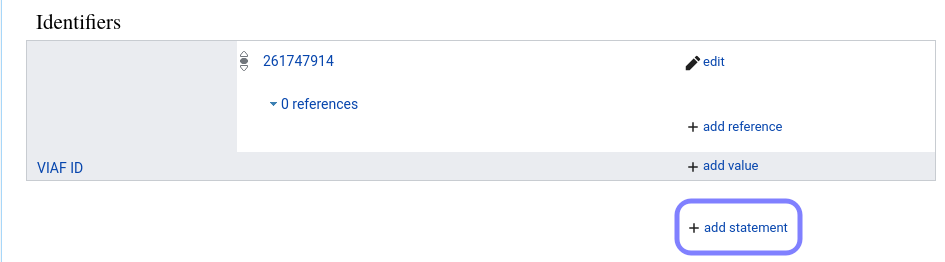

An empty Property field appears. Enter either P648 or OpenLibrary ID into the Property field and select OpenLibrary ID from the dropdown menu as shown in the screenshot below. 

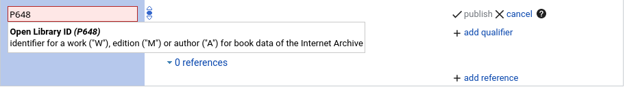

Afterwards the cursor will jump into a blank field, paste the OpenLibrary author ID into this field as shown in the screenshot below. The _publish_ link after the checkmark should turn blue.

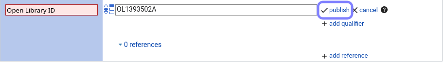

Click on the blue _publish_ link to save your entry. Afterwards, it should look like the screenshot below.

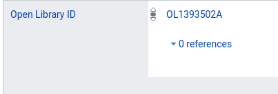

==== Amazon ID

Amazon uses its own internal ID for authors who subscribe to _Amazon Author Central_. It is therefore useful for authors who publish directly through Amazon or that Amazon considers important enough to give an ID on their own.

The Amazon ID is a 10-digit alphanumeric code that starts with a *B*.

==== Goodreads, LibraryThing, The Storygraph

Goodreads, LibraryThing and The Storygraph are social cataloging websites for storing and sharing book catalogs and various types of book metadata.
The Goodreads author ID is a purely numeric code which can be found in the Goodreads URL between _/show/_ and a “.” followed by the author’s name (highlighted in blue in the screenshot below).

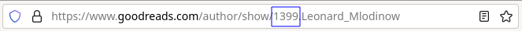

The LibraryThing author ID is an alphabetic code in Latin Script consisting of the author’s last name followed by the first name (highlighted in blue in the screenshot below). If several authors share a name, they are separated by a hyphen followed by a number, for example −1.

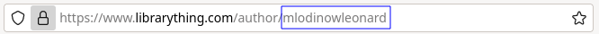

The Storygraph author ID is a lengthy hyphen-grouped alphanumeric code at the end of the author’s URL (highlighted in blue in the screenshot below).

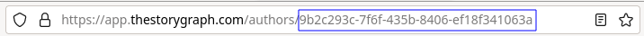.

==== LibriVox, Project Gutenberg

Both LibriVox and Project Gutenberg are volunteer efforts to make public domain works freely available. Project Gutenberg offers scanned and corrected texts, LibriVox turns public domain texts into free audio recordings.

The Project Gutenberg author ID is purely numerical and can be found at the end of the URL after _/author/_ (highlighted in blue in the screenshot below).

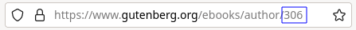

The LibriVox author ID is purely numerical and can be found between _primary_key=_ and _&search_ in the URL (highlighted in blue in the screenshot below).

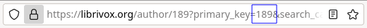

=== Please, leave a short note about what you changed

This is not necessary, but helps to find the last proper edit and to understand why the item was edited.
