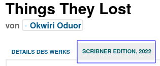

ifdef::env-github[]
:tip-caption: :bulb:
:note-caption: :information_source:
:important-caption: :heavy_exclamation_mark:
:caution-caption: :fire:
:warning-caption: :warning:
endif::[]

= Edition profiles
:icons: image
:icondir: images/icons/
:icontype: svg
:toc:
:toclevels: 4 

== Goal

Every published edition of a work should have one entry embedded within that work. Metadata should help readers to find the edition they are looking for.

(For the exact definition of the terms _work_ and _edition_, see: glossary)

== Problem

We import books from a variety of sources, which use different data formats. This leads to inconsistencies and errors. Furthermore, not all sources offer all data we need, leading to incomplete descriptions.

== Solution

Edition profiles can be edited by everyone with an OpenLibrary account.

== Procedure 

Open any editions's profile and click the _Edit_ button at the upper right corner of the screen. If you get a _Permission denied_ error, you need to log in to OpenLibrary (see: OpenLibrary accounts).

OpenLibrary will load the edit pages which includes two tabs: _Work Details_ and an _edition tab_, whose name usually starts with the publisher name followed by publication date. OpenLibrary usually loads the _edition tab_ by default.

=== This Edition

==== Title 
The pure title that describes this specific edition, without any additions.

Usually, the title should be rather obvious. Sometimes, vendors put series name, original titles of translated works or language information into the title. These should be removed from the title field and put into the correct field.

==== Subtitle
Used to distinguish between different books with similar titles or to add marketable information.

If the series name is printed on the book cover, it can be entered here as well.

=== Publishing Info

==== Who is the publisher?

The publisher or imprint should be added as it appears on the title page. If not present on the title page, it may be taken from the verso page.

==== Where was the book published?

The place a book was published, usually the city where the publisher's administration is located.

Ideally, write the cities in the native language of the country of origin followed by the region, state or country separated by a comma.

====
:example:

* Sydney, New South Wales, Australia
* Sydney, Nova Scotia, Canada
* Sydney, Hillsborough County, Florida, USA

====

==== When was it published?
The date when a specific edition was released to the public. The publication date is usually on the title or copyright pages of a book, but dates are sometimes on the jacket or back cover. If there are multiple dates listed use the latest date provided. This is sometimes phrased as published, printed, or copyright.

Dates should be in [Extended Date/Time Format](https://www.loc.gov/standards/datetime/), Level 2 (EDTF) as defined by the Library of Congress. This allows for detailed combinations of known, unknown and estimated dates.

* Day precision: [year]-[month]-[day]
** 1985-04-12 refers to the calendar date 1985 April 12th with day precision.
* reduced precision for year and month: [year]-[month]
** 1985-04 refers to the calendar month April in the year 1985 with month precision.
* reduced precision for year: [year]
** 1985 refers to the calendar year 1985 with year precision.

Missing digits should be replaced with an X, for example if we know that a book was released on the twelfth of a month in 1985, but not during which month, to 1985-XX-12. A completely unknown date is thus written as XXXX.

The year can be prefixed with a minus to indicate the book was released before the common era (BCE), for example -753-04-21 for the mythical foundation of Rome.

===== Estimated dates

Sometimes the date given is clearly earlier than the printing of that edition. For example, if a movie-tie-in edition is dated twenty years before the movie was released, you may estimate the date according to the movie's release. It is always useful to include information about this in the comments of your edit.

The characters '?', '~' and '%' are used to mean _uncertain_, _approximate_, and _uncertain_ as well as _approximate_, respectively. These characters may occur only at the end of the date string and apply to the entire date.

* 1984?
** year uncertain (possibly the year 1984, but not definitely)
* 2004-06~
** year-month approximate (around June 2004, but not definitely)
* 2004-06-11%
** entire date (year-month-day) uncertain and approximate (most likely release date was the 11th of June 2004, but not definitely).

===== Date ranges

If a book was released over a longer time span, one can enter two dates with a dash in between them.

* 2004-02-01/2005-02-08
** The release began on first of February 2004 and was finished on eighth of February 2005.

==== What is the copyright date?

he copyright date can be found as copyright notice in the imprint, often abbreviated by a © followed by a year. Only include if the imprint or title page offers a copyright date, because its usage differs wildly over time and jurisdictions.

==== Edition Name 

An edition describes different revisions of a given work, which a publisher considered important enough to tell apart.

====
:example:

Common edition names:

* First edition
* First American edition
* Third, revised edition
* Large Print Edition
* Book club edition
====

Originally, an edition included all copies of a book printed from a type-page. Due to a lack of international definitions, the use of editions can be rather ambiguous.

==== Series Name

This field describes the *publisher's series*, where a publisher bundles editions under one brand. Examples would be _Longman African classics_ by Pearson, the _Malaysian heritage series_ by S. Abdul Majeed & Co. or _Twayne’s world authors series_ by Gale.

You may also enter _literary series_, where author's intentionally connected several works, sometimes also called saga or cycle. Literary series should mainly be inserted on the xref:Librarians-Edit-Works.adoc[work's page] to make them searchable.

=== Contributors

People beside the author who were involved in the production of a book, for example an editor, a graphic designer or a typesetter.

=== Languages

Books are written in a language, and nobody speaks every language. Thus, it is extremely important to add the language the book is written in. For translations, also add the original title of the book and the original language.

OpenLibrary accepts all languages defined in the link:https://www.loc.gov/marc/languages/language_name.html[MARC Code List for Languages].

image:images/Librarians-Edit-Editions_language-translations.png[]

Enter the language a certain edition was written in into **What language is this edition written in?**. If an edition was printed in multiple languages, for example a bilingual edition, add further languages with **Add another language?**.

==== Is it a translation of another book?
 * No
 * Yes, it's a translation

Check *No* if the edition's language is identical to the original language. Otherwise, check *Yes, it's a translation* and enter data about the original book.

==== Original book
Enter the title of the original book, usually identical to the work title, and the language the original was written in.

=== Content

==== Description of this edition 
If this edition has a different blurb than the work, add it here. If the edition has the same blurb, leave this field empty.

==== Table of Contents
The table of contents can contain up to 4 column. A column can be created two ways: Either with a * or with a |. The * creates an empty cell, whereas the | separates two cells. A line break creates a new row.

[cols=_1,1,1,1_]
|===
|Column 1 | Column 2 | Column 3 | Column 4

|*
|**
|\***
|\****

| 1 \|
| 2 \|
| 3 \|
| 4
|===

==== Any notes about this specific edition?

Anything about the book that may be of interest and which takes it apart from other editions, like different illustrations or an improved index.

=== Is it known by any other titles? 

Sometimes books are published under different names, a common example are books with an UK and an US version -- for example Cecelia Ahern's _If You Could See Me Now_ (UK) as _A Silver Lining_ (US). It also happens with books that were turned into a movie or TV series -- for example Michael Crichton's _Eaters of the Dead_ as _The 13^th^ Warrior_.

If the edition is a collection or anthology, you may also add the individual titles of each work here -- for example, if a whole series was bundled in a box.

=== What work is this an edition of?

This links an edition to a specific work. Sometimes editions can be associated with the wrong work, in that case, senior librarians can reassign them here. Simply enter the ID or the title of the correct work here and save your change.

WARNING: When assigning an edition to another work, all other changes will be lost. Make sure to save before re-assigning an edition!

=== ID Numbers
An ID number or identifier clearly denotes a unique item, in our case a specific edition of a work. This makes it easier to distinguish between similar editions.

The most important ID numbers for OpenLibrary are ISBN and WorldCat, followed by ASIN for Amazon only eBooks. Other IDs are more situational, for example the identifiers of different National Libraries or other associations.

==== Internet Archive
Eligible archive.org items may be linked to the corresponding Open Library record. The archive.org item's Identifier may be entered into this field. Always check that the archive.org item does not already have Open Library IDs noted on the record. This is a restricted field. Super-librarians are able to add identifiers from the internetarchivebooks collection. Patron-uploaded items are not eligible and may not be linked from Open Library. 

==== ISBN
ISBN stands for International Standard Book Number, which consists of a numerical code and an alphanumeric checksum. It is the most commonly used identifier for books published after 1966. The format of ISBN changed three times so far:

SBN:: 9 digit SBN, used between 1966 and 1974.
ISBN-10:: 10 digit ISBN, used between 1970 and 2006.
ISBN-13:: 13 digit ISBN, used since 2007.

Books published before 1966 cannot have an ISBN, and books published before 1970 most likely won't have one. It can be written with or without hyphens, OpenLibrary will only save the pure number without hyphens.

It is possible to convert the different ISBN into each other:
SBN to ISBN-10:: Prefix the 9 bit SBN with a 0 to turn it into an ISBN-10 (345-24223-8 becomes 0-345-24223-8).
ISBN-10 to ISBN-13:: Prepend the ISBN with 978 and recalculate the checksum digit (0-345-24223-8 becomes 978-0-345-24223-5).
ISBN-13 to ISBN-10:: Only possible for ISBN-13 that start with 978. In that case, remove the 978 and recalculate the checksum digit (978-0-345-24223-5 becomes 0-345-24223-8).

Conversion can be done automatically with an link:https://www.isbn.org/ISBN_converter[ISBN Converter].

==== WorldCat
The WorldCat identifier is clearly marked as _OCLC Number / Unique Identifier_ on the website and consists of a numerical code.

WorldCat is an union catalogue that combines the catalogues of several thousand libraries. Their identifier is used in several databases to identify books published before 1970, and is the most valuable tool for libarians to sort editions.

==== ASIN
The Amazon Standard Identification Number is used by the online retail giant Amazon to identify its products. It consists of a ten digit alphanumeric code and starts with a B.

Printed books do not need an ASIN, as they are identical to the ISBN-10. Ebooks or digital audio books often lack an ISBN, especially if they are only distributed via Amazon. As Amazon became a major player in the self-publisher market, the ASIN is quite often the only available identifier for some editions.

==== Other Identifiers

OpenLibrary supports more than 50 identifiers, and new ones are regularly added. Please refer to the xref:EditionIdentifiersOnOpenLibrary.adoc[identifier description] for more details.

=== Classifications

A classification allows a library to sort and arrange resources systematically, to make them easy to find. OpenLibrary mainly uses classifications as imported from library MARC records.

Classifying a book goes well beyond the scope of this documentation, please refer to link:https://en.wikipedia.org/wiki/Library_classification[Wikipedia] or ask your local library for more information.

=== The Physical Object
==== What sort of book is it?
The book's binding, the most common forms are hardcover and paperback (sometimes also called softcover). Most online stores show the type of book, but there are also link:https://www.emptymirrorbooks.com/collecting/book-bindings[illustrated guides] for book bindings.

==== How many pages?
The total amount of pages a book has, regardless of pagination or content.

==== Pagination?
The highest page number printed on any page of the book. Most books have pages without a page number, therefore this number will usually lower than the total amount of pages. If a books uses multiple numbering systems, all are listed -- a typical example would be Roman numerals for pages before the first chapter. Empty pages might be stated in square brackets.

====
:example:

[1 - 7], VIII - XI, 12 - 174, [175 - 176]
====

==== How much does the book weigh?
The book's weight (or, for physic purists: the book's mass) in g, kg or ounces.

==== Dimensions
The book's size measured in centimeters or inches.

=== Web Book Providers

Web books are books that were published directly as web pages instead of any traditional book format.

When clicking on _Add a provider_, a new line appears where you can enter name and URL of the web book.

=== First sentence
The book's first sentence. If a book has a foreword or prologue, usually the first sentence of the first chapter, instead.

=== Please, leave a short note about what you changed

This is not necessary, but helps to find the last proper edit and to understand why the item was edited.
