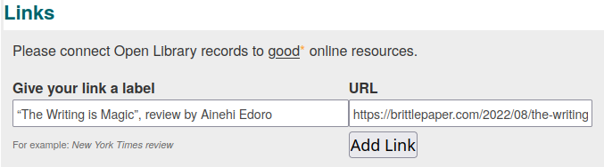

= Work profiles
:icons: image
:icondir: images/icons/
:icontype: svg
:toc:
:toclevels: 4

== Goal

Every published work should have one profile, that combines all its editions, and clearly differentiates it from other works. Metadata should help readers to find the book they are looking for.

For the exact definition of the terms _work_ and _edition_, see: glossary. For eligible works, consult xref:Librarians-Deletion.adoc  [Non-Book entries].

== Problem

We import editions, not works. Editions often lack information to which work they belong, as well as structured metadata necessary for libraries.

== Solution

Work profiles can be edited by everyone with an OpenLibrary account.

== Procedure 

Open any book's profile and click the _Edit_ button at the upper right corner of the screen. If you get a _Permission denied_ error, you need to log in to OpenLibrary (see: OpenLibrary accounts).

OpenLibrary will load the edit pages which includes two tabs: _Work Details_ and an _edition tab_, whose name usually starts with the publisher name followed by publication date. OpenLibrary loads the _edition tab_ by default. Click on _Work Details_ (highlighted in blue on the image below) to switch to the work tab.

image:images/Librarians-EditWorks-Tabs.png["Screenshot showing Editing, Things They Lost, by Okwiri Oduor, WORK DETAILS, SIMON & SCHUSTER edi..., 2022. WORK DETAILS is surrounded by a blue box."]

=== This Work
All information in this tab applies to all editions of a work. Data specific to an edition should go to the edition tab instead.

=== Title
The title of the very first release of a work in its original language.

=== Author
A drop down menu that allows you to select an already existing author or create a new one. You need to select an entry in the drop down menu, otherwise the information written into the field will not be saved.

The name should be written in the author's native language, see: xref:Librarians-Edit-Author.adoc[Edit Authors] for details.

=== How would you describe this book?

A short blurb that describes what the book is about and what a reader should expect. This description should be kept superficial, as not to spoil the plot, but still meaningful.

Interpretations or reviews of a book should be published outside OpenLibrary and linked in the <<Links, link section>>, instead.

=== Tags

Tags create a topical index of information in a library to find books about a certain area of interest. OpenLibrary uses a link:https://en.wikipedia.org/wiki/Folksonomy[Folksonomy] approach to tags, which can be described as collaborative or social tagging. Users can and should invent their own tags to describe works, if none of the existing tags fit. If you are not sure which tag to use, simply start typing -- the library will suggest existing tags that start with the same letters. Please re-use existing tags, if possible.

Tags can be written in any language that book was translated to or for which it has major importance.

==== Subject keywords?

Information like the book's genre, topic, target audience and so on.

====
:example:

* Children's fictional
* Juvenile fiction
* Action & Adventure
* Science fiction\--Hard Science fiction
====

===== Series and Curated Collections

OpenLibrary also uses subjects to link a book to a series or a collection. 

A **literary series** describes books that were intentionally connected by the author or authors, sometimes also called saga or cycle. Famous examples are _地球往事 (Remembrance of Earth's Past)_ by 刘慈欣 (Liu Cixin), _The Lord of the Rings_ by J. R. R. Tolkien, _The Loyal League_ by Alyssa Cole or _Brooklyn Brujas_ by Zoraida Córdova.

Any librarian can include books to a series with the tag _series:Name_Of_Series_.

(_Literary series_ need to be distinguished from _publisher's series_, where a publisher bundles editions under one brand. Examples would be _Longman African classics_ by Pearson, the _Malaysian heritage series_ by S. Abdul Majeed & Co. or _Twayne’s world authors series_ by Gale. Those should be inserted on the xref:Librarians-Edit-Editions.adoc[edition's page], instead.)

A **collection** consists of books on a certain topic chosen by a librarian. They might collect all stories that belong to a certain franchise, have a strong thematic bent or are helpful for a specific group of readers.

Those are marked with the tag _collection:Name_Of_Collection_.

Only curators can add books to a collection, please see xref:curated-collections.adoc[Create Curated Collections] for details.

An **award** is a special kind of tag, which includes winners or nominees for certain literature focused awards.

Those are marked with the tag _award:Name_Of_Award=category_.

Otherwise, awards work just like other tags.

==== A person? Or, people?

This can be any individual or group of individuals. If a name describes several persons, you should add qualifiers like date of birth, date of death, or occupation. You may also enter fictional, legendary or mythic names. Qualifiers should be added in parentheses after the name.

====
:example:

* ʿĀ’ishah bint Yūsuf al-Bāʿūniyyah (Sufi mystic, ? - 1517)
* John Wick (fictional character)
====

==== Note any places mentioned?

This can be any geographic location, from a building to a continent.

Remember that OpenLibrary is a worldwide library and thus needs more specific data than local libraries, as several places might share a name. So make sure to prepend the place name with an identifier followed by two hyphens.

You may enter fictional, legendary or mythic places with a qualifier.

====
:example:
A few places called link:https://en.wikipedia.org/wiki/Cairo_(disambiguation)[Cairo] according to LCSH:

* Egypt\--Cairo
* USA\--Georgia\--Cairo
* Colombia\--El Cairo
====

==== When is it set or about?

This can be any point in time or time span, both in numerals or descriptive titles like eras, epochs, famous events or regnal years. The standard calendar for numerical years on OpenLibrary is the Georgian calendar.

====
:example:
All of the following are valid times:

* Archean
* Permian–Triassic extinction event
* Renaissance
* Seleucid era
* Later Three Kingdoms period
* 4th century BC
* 607 AD
* First World War (1914-1918)
* 20 June 1960

====

=== Add Excerpts

You may add an excerpts from a work, to show what makes it special or just as a teaser. As with the blurb, you should keep excerpts short enough not to spoil the plot, but still detailed enough to give a good impression. You can enter an excerpt from any edition of a work.

==== Page number?
If I open the book, where does the excerpt start?

==== Transcribe the excerpt
Enter the quote from the book into this field. It must be shorter than 2000 characters and cannot be formatted in any way.

==== Why did you choose this excerpt?
Describe in your own words why you think the chosen part characterizes the book well.

=== Links

Sometimes, a work requires context to be fully appreciated. A library catalogue cannot create this context on its own, thus we encourage connections to good online resources: In-depth reviews or influential reviews of a work, academic discussions of a work, trends set by a work, a works influence on popular culture or an eulogy for the work.

You need to fill two fields to add a link: _Give your link a label_ and _URL_. Both fields are necessary, otherwise the link won't work. The label should be evocative, not just _review_ or _discussion_.

The link need to be relevant to the work, please report irrelevant links or spam through the link:https://openlibrary.org/contact[contact form].

=== Please, leave a short note about what you changed

This is not necessary, but helps to find the last proper edit and to understand why the item was edited.
