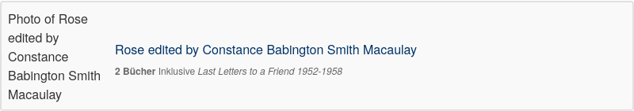
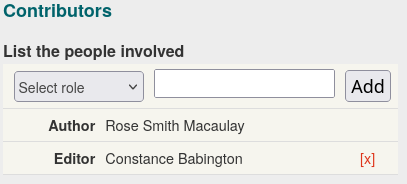
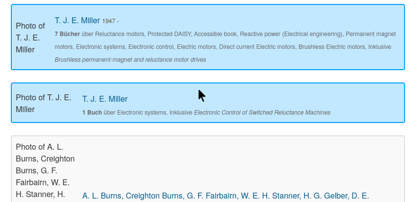
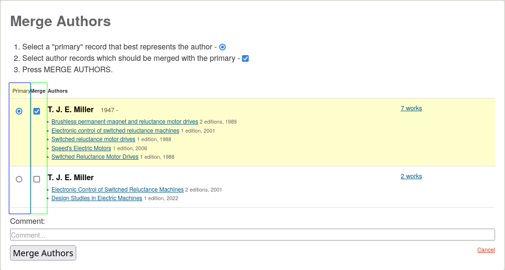

= Duplicate author entries
:icons: image
:icondir: images/icons/
:icontype: svg
:toc:
:toclevels: 4

== Goal
Any author should have only one profile on OpenLibrary, listing all books written by that author.

== Problem
Pseudonyms, pen names, transliterations, spelling errors, usage of middle names, bad sources, differences in character encoding and mistakes during a book import can cause multiple entries for an author. Those create duplicate author entries, which lead to partial book lists in several places.

== Solution
Duplicate author entries can be merged. A merge copies all information from duplicate profiles into the author’s main profile and hides the duplicate profile behind a link.

== Procedure
The merge process depends on your status: Visitor, Patron, Librarian or Lead librarian.

=== Visitors and Patrons
Please report duplicate author entries through the contact form. We need the author’s name and the profile IDs. The profile ID starts with *OL* followed by numbers and ends with *A*. (You can simply copy the link to the author’s profiles, it contains the ID).

====
:example:
link:https://openlibrary.org/authors/OL4586796A/[Gabriel García Márquez] has the author ID *OL4586796A*.
====

It often helps to write a short description why two profiles should be merged, especially if the names differ.

=== Librarians
Librarians have access to the merge request tool, which makes it easier to report a great number of duplicate profiles at once. It works just like the merge tool for lead librarians, but only issues a merge review request instead of executing a merge.

Please write a comment to your merge requests unless they are extremely obvious duplicates.

Before submitting a merge requests, Librarians should thoroughly check all profiles, just as if they were reviewing a merge request as a lead librarian.

=== Lead Librarians
Only lead librarians can merge authors. It is extremely difficult to undo an author merge gone wrong, thus author merges require utmost care and extensive checking. If in doubt, ask for a review of your proposed merge. Only merge if you are absolutely certain.

WARNING: If you detect any mistaken author merge, immediately notify Lisa (Agent Sapphire), either on Slack or via the Contact Form. If possible, include the merge URL (see: <<anchor-ManualMerge,Manual Merge>>). Desist from any other repair attempts. The quicker you report an accidental merge, and the less changes occured after the accidental merge, the easier it can be undone.

==== 1. Check whether truly all books in all selected profiles are from the same author.

Sometimes authors are conflated, that means the books of several authors are mixed in one profile. In that case, the books need to be assigned to the correct author before a merge. Conflation can happen by accident, when several authors share one common name. Sometimes, authors also purposefully choose a pen name similar or even identical to that of an established author to freeload on that author’s fame.

The topics are a good indicator: If they wildly fluctuate, you should always cross-check with several other sources.

==== 2. Check whether truly all profiles are the same author

Some names are just extremely common or at least common pen names, and might be shared by multiple authors. Abbreviated names can also point to different authors, a J. Miller might be Jeanne, John or Jackie Miller. And each of them might be a Miller junior or a Miller senior.

You should check at least link:https://viaf.org/[VIAF] for other authors with this name, but ideally also link:https://www.wikidata.org/[Wikidata] and link:https://isni.oclc.org/[ISNI]. The link:https://en.wikipedia.org/wiki/List_of_national_and_state_libraries[National Library] of the author’s place of residence can also be helpful. (See: xref:Librarians-Edit-Author.adoc[editing authors]).

Some author entries have import data in their profile History. This can also help with establishing the identity of a profile. The History can be found on the bottom left of the page. If the first entry reads _Imported from_ followed by a name like _MARC record_ that doubles as a link, the link points to the import data.

==== 3. Clean conflated author names
Sometimes the author profile name consists of several different authors. This happens most often with translations or anthologies, where all contributors were accidently written into one author field instead of separate author fields. It can also be caused by faulty OCR during digitalization of older books.

Conflated authors need to be resolved before a merge. Everyone mentioned in the author field needs to get properly added: either to the author field, if they wrote at least parts of the work themselves, or as contributors in the edition record, if they were translators, illustrators, narrators or the like. (For details on where to add contributors, consult the documentation on editing books).

Afterwards, all names but the main author’s name are deleted from the profile name.

====
:example:

The screenshot below shows an example of a conflated author: Rose edited by Constance Babington Smith Macaulay. In this case, it contains the name of the author *Rose Smith Macaulay* and the editor *Constance Babington*.

Hence, the author profile should be renamed to Rose Smith Macaulay. Constance Babington would be added as editor in the contributor section for those books she edited.

====

==== 4. Select a primary profile

Always choose the oldest profile as primary profile. The age of a profile can be checked in two ways: Either through the profile’s History or by comparing the profile IDs.

The History can be found on the bottom left, look for an entry like _initial import_, _imported by_ or _added new author_. The exact name can differ, depending on how the profile was added. Each revision in the history has a date field at the front.

The profile ID can be found in the URL bar. It contains a number clasped by the letters *OL* and *A*. This number is sequential, meaning the lower the number, the older the profile.

==== 5. Perform the actual merge
The merge can be performed in two ways: Either with the magic merge wand (recommended) or by manually adding profile IDs to a merge list.

===== Magic wand
The magic merge wand is integrated into the search results. Search for duplicate authors as usual. Select the duplicate entries by clicking inside the grey work box that is not a link. The entry should turn blue.

TIP: The magic merge wand only works on one search page. It forgets all highlights if you switch to another search page. If you want to merge duplicate author profiles from different search result pages, you need to either do it iteratively, manually or tweak your search (see: Search documentation).

Once you have selected all duplicate profiles, click on the _Merge Authors…_ button at the bottom right of the page. This will open the Merge UI.

In the Merge UI, you will have to choose a primary profile (first column, marked blue on the screenshot). All other profiles will redirect to this profile. As explained in step 4, this should always be the oldest profile.

You also need to mark all profiles that you want to merge in the merge column (second column, marked green on the screenshot), otherwise the merge will fail with the error message: _No authors selected. Please select some authors to merge._

Confirm the warning dialog that you were careful.

Afterwards, you are sent to the main profile and just have to wait for the merge to complete. Keep the window open until the merge succeeded.

[[anchor-ManualMerge]]
===== Manual merge
The Merge UI can be triggered manually by adding the author profile IDs to the Merge request URL. The merge URL consists of the base merge URL, a designator, the author ID and a connector.

.Manual Merge URL
Base merge url:: https://openlibrary.org/authors/merge?
Designator:: key=
Author ID:: OLxxxA (where the xxx represents a natural number)
Connector:: &
Hence, a full merge URL would look like this:: https://openlibrary.org/authors/merge?key=OLxx1A&key=OLxx2A&key=OLxx3A

The procedure is rather error prone and should only be used as a last resort. It is highly recommended to ask another librarian to review your manual merge before execution.

Otherwise, a manual merge works just like a merge initiated by the magic wand.
