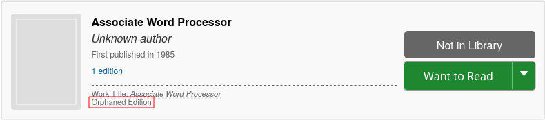
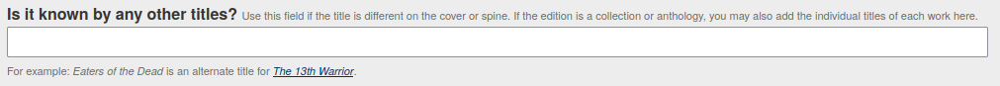
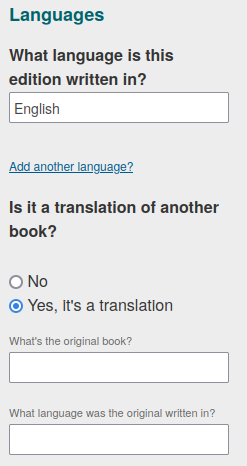
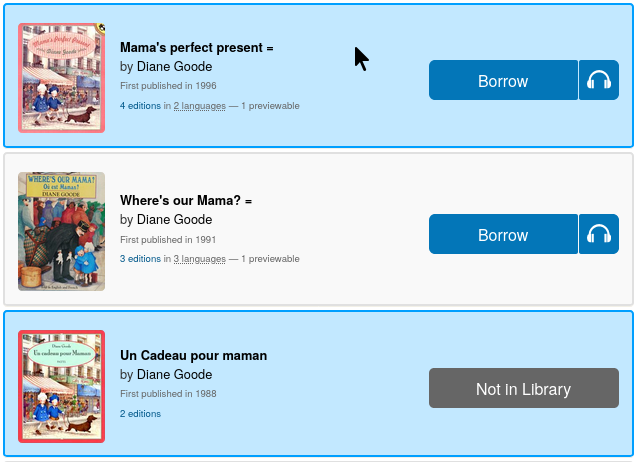
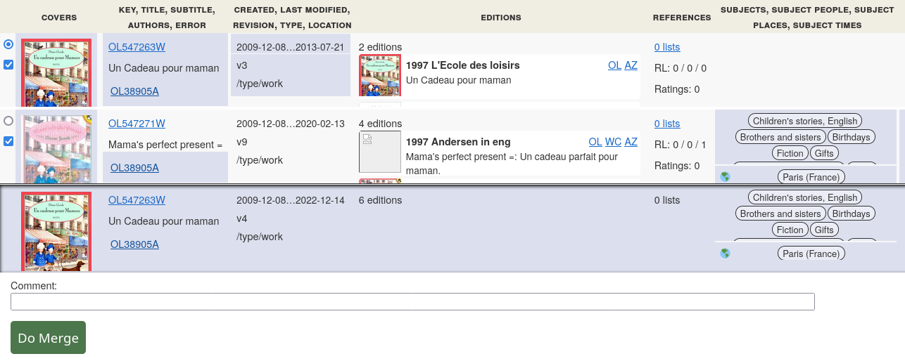

ifdef::env-github[]
:tip-caption: :bulb:
:note-caption: :information_source:
:important-caption: :heavy_exclamation_mark:
:caution-caption: :fire:
:warning-caption: :warning:
endif::[]

= Duplicate work entries
:icons: image
:icondir: images/icons/
:icontype: svg
:toc:
:toclevels: 4

== Goal
A work should only exist once, and contain all editions related to this work.

== Problem
It is impossible to manually import and check all new works released, therefore OpenLibrary depends on automated import from several different sources. Not all of those sources describe their books identically, which can lead to duplicate entries. Another cause for duplicates are variant titles. Translations of a book might lack the information to connect it to the original and also cause duplicates.

== Solution
Duplicate works can be merged. A merge migrates all editions from duplicate works into the main work and redirects the duplicate work records to the primary work record. 

== Procedure
The merge process depends on your status: Visitor, Patron, Librarian or Lead librarian.

=== Visitors and Patrons
Please report duplicate work entries through the link:https://openlibrary.org/contact[contact form]. We need the works name and the work IDs. The work ID starts with *OL* followed by numbers and ends with *W*. (You can simply copy the link to the work profiles, it contains the ID).

====
:example:
link:https://openlibrary.org/works/OL5731538W[Purple Hibiscus] by by _Chimamanda Ngozi Adichie_ has the work ID *OL5731538W*.
====

Please write a short comment why those works should be merged.

=== Librarians
Librarians have access to the merge request tool, which makes it easier to report a great number of duplicate works at once. It works just like the merge tool for lead librarians, but only submits a merge review request instead of executing a merge.

Please write a comment to your merge requests unless they are obvious duplicates.

Before submitting a merge requests, Librarians should thoroughly check all profiles, just as if they were reviewing a merge request as a Lead librarian.

=== Lead Librarians
Only lead librarians can merge works. While an undo is possible, it is rather tedious -- so, be careful, please.

WARNING: If you detect any mistaken works merge, please notify Lisa (Agent Sapphire), either on Slack or via the Contact Form. Supply the merged work and which editions were wrongly added.

==== 1. Check that works are true duplicates and beware of easy pitfalls

Do not judge a book by its title! While the title is an indicator, it is not proof that two books are identical.

Take link:https://openlibrary.org/search?q=title%3A+%22Joyland%22&mode=everything[Joyland] for example. There are several disparate books with this title, written by completely different authors, unaware of each other: Andy Mckee, Emily Schultz, Pam Andrews and Stephen King.

At the same time, one book might be known under different titles. Agatha Christie's link:https://openlibrary.org/works/OL471943W/[After the funeral] was also published as _Funerals are fatal_, _Les indiscretions d’Hercule Poirot_, and _Der Wachsblumenstrauß_.

Another common problem are adaptations, dramatisations, book notes, study guides, criticism: They often share the main title with the book they supplement, just told apart by a subtitle or other minutae. Nonetheless, they are a work on their own and must be kept apart! Look for titles that include the author’s name, for example _Mark Twain’s Huckleberry Finn_, or any mention of reading levels.

Lastly, there might be abridged versions of a work, this is especially common for early audio books.

For a more detailed overview reference the documentation on Derived Works, Collections, or Other Special Cases.

NOTE: Works with the same content should be merged, works with different content should be kept separate.

==== 2. Check for conflated editions

Look at the editions listed for each work. Make sure the titles are all correct for the work they are associated with. Conflation is common for works that belong to a series or for collected works, i.e. short stories, poetry, anything with the name _Works of_.

This also happens rather often when a book was released as complete volume and partial volumes. Usually, it is the first partial work that gets wrongly assigned to the complete work.

Editions that do not belong to a work need to be re-assigned to the correct work before a merge (see: xref:Librarians-Edit-Editions.adoc#what-work-is-this-an-edition-of>[Assigning Editions]).

==== 3. Assign orphaned editions

Some entries look like works, but are orphaned editions instead. They cannot be merged, but need to be assigned to the correct work (see: xref:Librarians-Edit-Editions.adoc#what-work-is-this-an-edition-of>[Assigning Editions]).

Orphaned editions can be identified in two ways:

1. The entry lacks an identifier that ends with _W_ and instead only has an _M_ identifier.
2. In the search results, there is a small notifier _orphaned edition_ at bottom of the entry. (Highlighted in red on the picture below. Only Librarians see this notification.)

==== 4. Make sure all works have the same title

CAUTION: The works should have the same title, not the editions! Editions should keep their individual titles, and they may vary from the work title (see <<_1_check_that_works_are_true_duplicates_and_beware_of_easy_pitfalls,Step 1>>).

See Editing Books on how to determine the correct work title.

==== 5. Remove publishers, narrators, translators and similar contributors from the author field

The author field should usually show the author of the original edition only, most contributors should be listed in the contributors section. There are a few exceptions, for example to disambiguate books with similar titles and authors. Please reference the documentation on Editing Books who should be considered an author.

==== 6. Add and correct necessary metadata

===== 6.1 Spelling of Title 

Titles with Umlauts or diacritic characters are often misspelled. If possible, correct those titles and add the wrongly written title to the _Is it known by any other titles?_ box.

===== 6.2 Language

Books are written in a language, and nobody speaks every language. Thus, it is extremely important to add the language the book is written in. For translations, also add the original title of the book and the original language.

===== 6.3 Other fields

Other fields to check are publication date and publisher. They are not as important, but help with identifying books. Ideally, also add missing ISBN numbers or Worldcat OCLC, as those are accurate for the given edition record.

=== 7. Select a primary work

Always choose the oldest work as primary work. The age of a profile can be checked in two ways: Either through the profile's History or by comparing the profile IDs.

The History can be found on the bottom left, look for an entry like _initial import_, _imported by_ or _added new work_. The exact name can differ, depending on how the profile was added. Each revision in the history has a date field at the front. (This can be very difficult if a work has many editions).

The profile ID can be found in the URL bar. It contains a number clasped by the letters _OL_ and _W_. This number is sequential, meaning the lower the number, the older the profile. (All other works are called secondary for the purpose of this manual.)

=== 8. Check the amount of editions

Check how many editions each involved work has.

The primary profile can have as many editions as it wants, but secondary works must not exceed 200 editions, otherwise the merge will fail.

Thus, you need to assign editions in excess of 200 from secondary works to the primary work first. If a work tops the limit by just a few editions, you can do that manually (see: Assigning Editions). Otherwise, you need to use the link:https://colab.research.google.com/drive/1BO0c8aDpfENA8Qsg0-fv_7st6j4AmeAq?usp=sharing#scrollTo=-zun5QSIrYaZ[Google Colab Migrate Editions Tool].

The Migrate Editions Tool requires link:https://github.com/internetarchive/openlibrary/wiki/Writing-Bots[bot privileges]. If you do not have or want bot privileges, please submit a merge request instead.

=== 9. Perform the actual merge

The merge can be performed in two ways: Either with the magic merge wand (recommended) or by manually adding work IDs to a merge list.

==== Magic wand
The magic merge wand is integrated into the search results. Search for duplicate books as usual. Select the duplicate entries by clicking inside the grey work box that is not a link. The entry should turn blue.

TIP: The magic merge wand remembers your selections, even if you start a new search. Make sure to empty it before starting on a new work!

Once you have selected all duplicate profiles, click on the _Merge Works_ button at the bottom right of the page. This will open the Merge UI.

The first column offers two checkboxes: The dot selects the primary work, the check mark selects which works should be merged. All works with a blue check mark are merged, those with a blank square are not merged. The lowermost entry shows the result of the merge.

By clicking on the green button Do Merge, you execute a merge.

By clicking on the red button Reject Merge, you reject a merge. (This button only exist when reviewing a merge.) If you reject a merge, you should always write a comment why you rejected this specific merge.

==== Manual merge
The Merge UI can be triggered manually by adding the author profile IDs to the Merge request URL. The merge URL consists of the base merge URL, a work ID and  connectors.

.Manual Merge URL
Base merge url:: https://openlibrary.org/works/merge?records=
Work ID:: OLxxxW
Author ID:: OLxxxA (where the xxx represents a natural number)
Connector:: ,
Hence, a full merge URL would look like this:: https://openlibrary.org/works/merge?records=OLxx1W,OLxx2W,OLxx3W

The procedure is rather error prone and should only be used as a last resort. It is highly recommended to ask another librarian to review your manual merge before execution.

Otherwise, a manual merge works just like a merge initiated by the magic wand.
